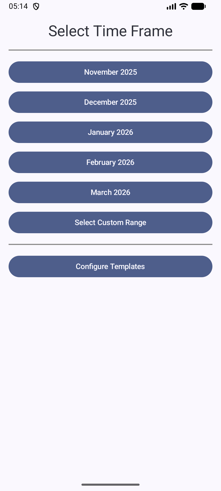
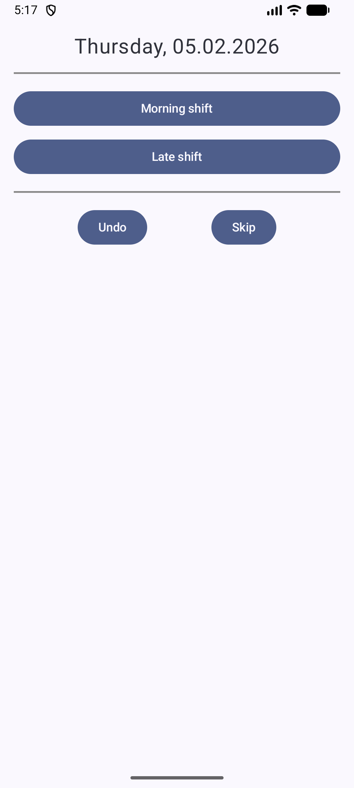
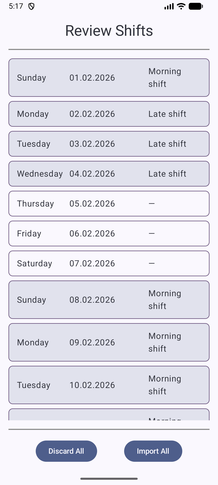
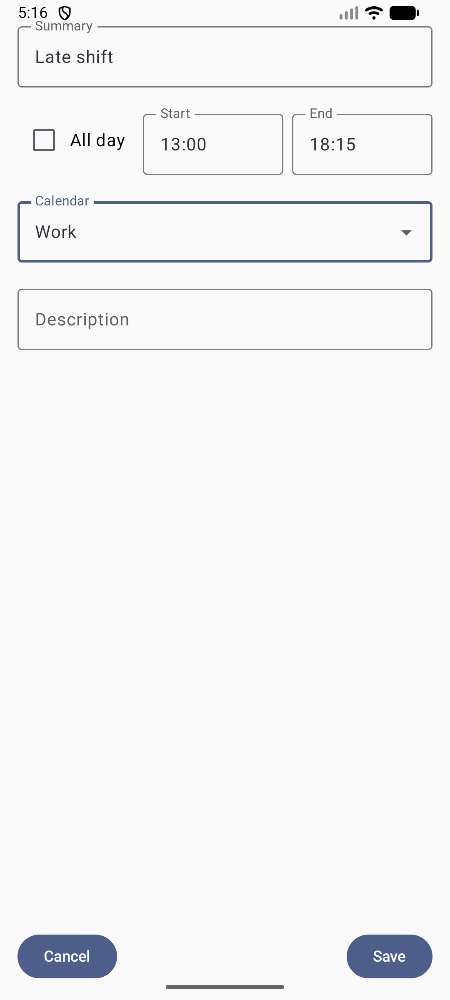

# Shift Plan Importer

Shift Plan Importer is an Android app that helps you to quickly and easily import your work shifts
into your calendar.

**Currently not available in Play Store/F-Droid.**

## Features

- Define reusable shift templates with a name, start time, and end time.
- Select a date range for which you want to enter your shifts.
- Quickly enter shifts for each day, using your predefined templates.
- Skip days you don't work.
- Review your entered shifts before importing.
- Import all shifts into your device's calendar with a single tap.

## How to use

1. One time setup: Go to "Configure templates" to setup different types of shifts you work. A
   template consists of a name (e.g., "Night Shift") and a start and end time.
2. Go back to the main screen and select the time frame (e.g., the upcoming month) for which you
   want to enter your shifts.
3. For each day in the selected period, tap the shift you are scheduled to work. You can also skip
   days. If you made a mistake, you can undo your last entry.
4. After entering all your shifts, you can review them. You can also edit single shifts from the
   review screen.
5. If everything is correct, tap "Import All" to add all the shifts to your calendar. The app will
   ask for calendar permissions.

## Screenshots

### Main Screen

### Enter Shifts

### Review Shifts

### Shift Templates

